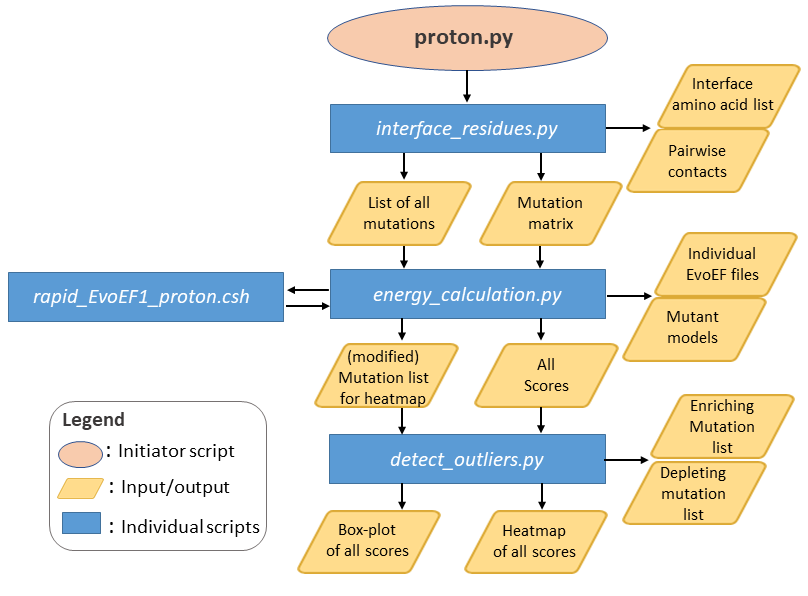

<p align="center">
  
</p>

### PROT-ON: A Structure- and Statistics-Based Detection of Designer PROTein Interface MutatiONs

### Motivation

PROT-ON’s primary aim is to deliver the most critical PPI mutations, i.e., the designer mutations, that can be used to propose new binders. For this, PROT-ON probes all possible interface mutations with either [EvoEF1](https://github.com/tommyhuangthu/EvoEF) or [FoldX](http://foldxsuite.crg.eu/) on a selected protein partner, filters the mutational landscape according to stability and/or mutability criteria, and statistically analyzes the final mutation set to propose the most binding enriching and depleting interfacial mutations in less than five minutes.

### PROT-ON Architecture
<p align="center">

</p>

### PROT-ON Input
PROT-ON works on protein dimers. It takes the PDB file of a dimer as an input together with the chain ID that should be modified/scanned by the program. 

If the user would like to incorporate a PSSM-based filter on the predictions, an externally generated PSSM file (in csv format with the `<root-pdb-filename>_chain_<chain_ID>_pssm.csv` naming) should be placed in the run directory. The PSSM scores (you can obtain from https://possum.erc.monash.edu/server.jsp) should be seperated with a comma `,`. An exemplary PSSM file is located in the `example-run` directory. 

### PROT-ON Output Files
`proton.py` script with the described [Usage](https://github.com/CSB-KaracaLab/prot-on/tree/main#usage) generates: 
  * **Interface amino acid list:** Interfacial amino acid list (within a defined cut-off), belonging to the input chain ID, calculated by `interface_residues.py`. The same script outputs the pairwise contacts, as **Contact list:**
  * **Mutation list:** The list of all possible interfacial mutations (format: KD28A; K: Wild-type amino acid, D: Chain ID, 28: Amino acid position, A: Mutant amino acid)
  * **Mutation models:** Generated mutant models modelled by `BuildMutant` command of EvoEF1.
  * **Individual EvoEF1/FoldX files:** EvoEF1/FoldX binding affinity predictions calculated by `ComputeBinding` of EvoEF1 or `AnalyseComplex` of FoldX.
  * **Boxplot of EvoEF1/FoldX scores:** All EvoEF1/FoldX binding affinity predictions are analyzed with the box-whisker statistics, where;
  * **Depleting mutations:** are defined by the positive outliers, and;
  * **Enriching mutations:** are defined by the negative outliers. 
  * **Heatmap of PROT-ON scores:** All possible mutation energies are plotted as a heatmap for visual inspection.
  * **Filtered mutations:** Stability-filtered (uses `ComputeStability` command of EvoEF1 or `Stability` command of FoldX, where DDG-stability<0) enriching and depleting mutations and optionally PSSM-filtered (Enriching mutations with PSSM-score >0 && Depleting mutations with PSSM-score <=0).
  
### System dependencies
* [EvoEF1](https://github.com/tommyhuangthu/EvoEF)
* [FoldX](http://foldxsuite.crg.eu/)
* conda (OR python3)

### Python dependencies
* numpy
* pandas (**should be version 1.3.0 or higher**)
* plotly
* shutil
* time
* kaleido
## Usage
### Clone the repository
```
git clone https://github.com/CSB-KaracaLab/prot-on.git
```
```
cd prot-on
```
After this, the pre-installed EvoEF folder, FoldX executable and rotabase.txt files should be moved into the `prot-on` directory and `setup.py` should be run according to the [EvoEF1](https://github.com/tommyhuangthu/EvoEF) instruction.

### Installation
For Linux or MacOS
```
conda activate
```
```
python proton.py <pdb-filename> <chainID> <cut_off> <IQR>

Example:

python proton.py complex.pdb D 5.0 1.5> proton.log
```
If you call python3 independently (not with conda), then you should execute:
``` 
python3 proton.py <pdb-filename> <chainID> <cut_off> <IQR>
```
### Usage of individual scripts
If you want, you can also run the PROT-ON scripts located under `src/` independently. 

As an example, if you are interested only getting the interface information on the complex you study, you can use `interface_residues.py` as in:
```
python inteface_residues.py <pdb-filename> <chainID> <cut_off> <IQR>

Example:

python inteface_residues.py complex.pdb D 5.0 1.5
```
Or if you are insterested just in the binding affinity prediction for a specific mutation list, you can use `energy_calculation_EvoEF.py` as in:
```
python energy_calculation_EvoEF.py <pdb-filename> <mutation_list> <algorithm> 

Example for EvoEF1:

python energy_calculation_FoldX.py complex.pdb D mutation_list 1
```
```
Example for FoldX

python energy_calculation_FoldX.py complex.pdb D mutation_list 2
```
You can generate boxplot, heatmap, or depleted&enriched mutation list with `detect_outliers.py`:
```
python detect_outliers.py <pdb-filename> <chainID> <proton_scores> <algorithm> <IQR>

Example for optimized EvoEF1:

python detect_outliers.py complex.pdb D complex_chain_D_proton_scores 3 1.5
```
## Web Server
You can access user friendly web server of PROT-ON in here: http://proton.tools.ibg.edu.tr:8001
## Acknowledgement
We would like to thank Ayşe Berçin Barlas for her assistance in revising the code architecture. We also thank Eda Şamiloğlu and Mehmet Ergüven for their contribution to the intial phase of the project. Also big thanks to İrem Yılmazbilek for analyzing the case studies to test the PROT-ON performance to detect the crical positions and mutations. 
## Bug Report
If you encounter any problem, you can contact Mehdi or Ezgi via:
## Contacts
* ezgi.karaca@ibg.edu.tr
* mehdi.kosaca@ibg.edu.tr
