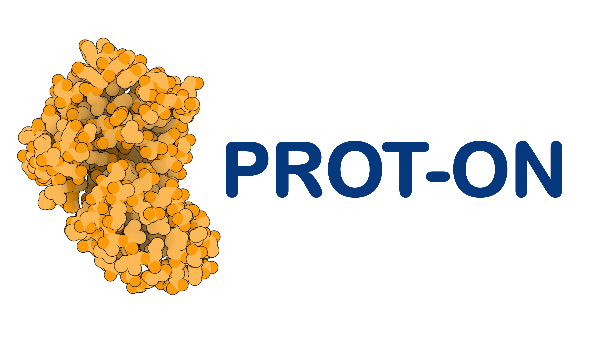
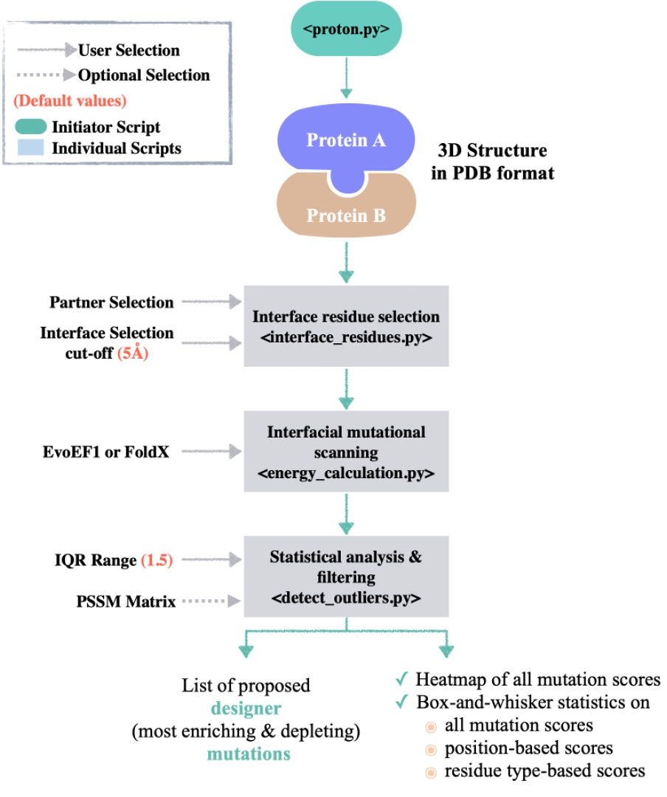

<p align="center">
  
</p>

### PROT-ON: A Structure-Based Detection of Designer PROTein Interface MutatiONs

### Motivation

PROT-ON’s primary aim is to deliver the critical (designer) PPI mutations that can be used to propose new protein binders. For this, PROT-ON uses the coordinates of a protein complex. It then probes all possible interface mutations with either [EvoEF1](https://github.com/tommyhuangthu/EvoEF) or [FoldX](http://foldxsuite.crg.eu/) on the selected protein monomer. The probed mutational landscape is then filtered according to the stability and optionally to the mutability criteria. PROT-ON finally statistically analyzes the energy landscape spanned by the probed mutation set with the aim of proposing the most binding enriching and depleting interfacial mutations.

## Web Server
This site describes the use of stand-alone version of PROT-ON, which is tested on Linux and MacOS systems. If you would like to use our tool through our web service, please visit http://proton.tools.ibg.edu.tr:8001

### PROT-ON Architecture
PROT-ON calls several python scripts to find the designer mutations (binding enriching/depleting) on one monomer of a complex. Here is the flow of the approach:
<p align="center">

</p>

## Usage

### System dependencies
* python3 OR conda (version 4.10 or higher)
* [FoldX 4.0](http://foldxsuite.crg.eu/) (optional)

### Python dependencies (also listed in requirements.txt)
* numpy
* pandas (**should be version 1.3.0 or higher**)
* plotly
* kaleido
* shutil
* time
* virtualenv

### Clone the repository
```
git clone https://github.com/CSB-KaracaLab/prot-on.git
```
```
cd prot-on
```
### Environment Setup

We strongly suggest creating a Python Virtual Envrionment before the installation of PROT-ON dependencies. After creating the environment and activate it, you will find the `setup.py`, which will set the stage to run PROT-ON in the `prot-on` folder. January-2021 version of EvoEF1 also comes together with the PROT-ON package. 

```
python3 -m venv <environment name>
source <environment name>/bin/activate
python setup.py
```

As a result of running `setup.py`, PROT-ON will be ready to perform the mutational scan with EvoEF1. 

### To Run PROT-ON
* **Must:** Please locate your complex PDB file in the `prot-on` folder. Also, you can call your dimer structure from wherever you want. An example complex file is located in the `example-input` directory.

* **Optional:** If you would like to perform the mutational scanning with FoldX, you first have to get its academic licenced soure files. Among the provided source files, please locate the FoldX executable (please name it as `foldx`) and `rotabase.txt` directly in the `prot-on/src` folder.

* **Optional:** If you would like to include the evolutionary information into the filtering process, please obtain the PSSM file of the monomer you will be scanning in the csv format. The external PSSM file, which can be obtained via https://possum.erc.monash.edu/server.jsp should be in a comma `,` seperated format. Please name your PSSM file as `<root-pdb-filename>_chain_<chain_ID>_pssm.csv` and place it in the `prot-on` folder. You can find an example PSSM file under `example-input` directory.

* After these steps, you can execute PROT-ON on your PDB formatted complex via:
```
python proton.py --pdb <filename of the structure> --chain_ID <chain ID of interest> --algorithm <EvoEF1/FoldX> --cut_off <cut-off to define the interface> --IQR <IQR rule to define outliers of box-and-whisker statistics>

Example:

python proton.py --pdb complex.pdb --chain_ID D --algorithm EvoEF1 --cut_off 5.0 --IQR 1.5
```
If you call python3 independently (not with conda), then you should execute (which is also valid for any python command given below):
``` 
python3 proton.py --pdb complex.pdb --chain_ID D --algorithm FoldX --cut_off 5.0 --IQR 1.5
```
Here `cut-off`, `IQR` and `algorithm` definitions are optional. By default they will be set to 5.0, 1.5 and EvoEF1 respectively. If these settings are fine with you, you can run PROT-ON with only:
``` 
python proton.py --pdb complex.pdb --chain_ID D 
```
You can also call the help page of PROT-ON with:
``` 
python proton.py --help
```
### PROT-ON Output Files
When PROT-ON is finished, your results will be located at `results/runID_PDBID_chainID_output` folder. In this folder, as given in the `example-output` folder, you will find: 
  * **Parameters:** Containing the defined interface cut-off and IQR range.
  * **Interface amino acid list:** Interfacial amino acid list. This file corresponds to `complex_chain_D_interface_aa_list` in the `example-output` folder.
  * **Pairwise inter-monomeric distance list**: `complex_pairwise_distance_list` as given in the `example-output` folder.
  * **Mutation list:** The list of all possible interfacial mutations (format: KD28A; K: Wild-type amino acid, D: Chain ID, 28: Amino acid position, A: Mutant amino acid). `complex_chain_D_mutation_list` as given in the `example-output` folder.
  * **Mutation models:** The folder containing all the generated mutant structures. 
  * All EvoEF1/FoldX binding affinity predictions are analyzed with the box-whisker statistics, where;
  * **Depleting mutations:** are defined by the positive outliers (as in `complex_chain_D_depleting_mutations` in `example-output`), and;
  * **Enriching mutations:** are defined by the negative outliers (as in `complex_chain_D_enriching_mutations` in `example-output`). 
  * **Heatmap source file:** is given in `heatmap_df` in a single column format. This file can be converted ınto a 2x2 matrix by executing `pivot_table = heatmap_df.pivot("Positions","Mutations","DDG_{}_Scores".format(algorithm)`
  * **Designer mutations:** Stability-filtered enriching and depleting mutations, named as `complex_chain_D_stabilizing_enriching_mutations` and `complex_chain_D_stabilizing_depleting_mutations` as given in the `example-output` directory .
  * **Complete list of all PROT-ON scores:** All the scores calculated throughout a single run are saved under `complex_chain_{}_proton_scores`.
  * **Graphical Outputs:** We provide png and svg files of the scanned mutational energies as a heatmap, as a boxplot distribution representing all interfacial binding scores, as well as as boxplot distributions of the scores according to residue position and type.

Thank you for following our guidelines until this point! We hope that you will enjoy using our package!

## Acknowledgement
We would like to thank Ayşe Berçin Barlas for her assistance in revising the code architecture.

## Bug Report & Feedback
If you encounter any problem, you can contact Mehdi or Ezgi via:
## Contacts
* ezgi.karaca@ibg.edu.tr
* mehdi.kosaca@ibg.edu.tr
